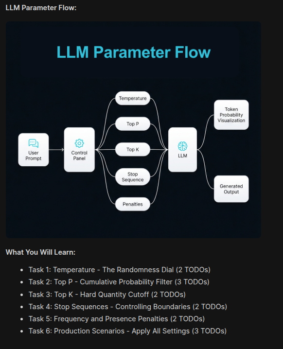
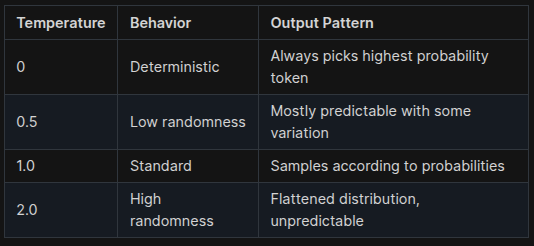

# Welcome to Your KK Development Environment 🚀

This workspace provides a fully-functional **Visual Studio Code** editor to develop, test, and debug your projects.

---

## Getting Started

### Open a New Terminal
Use the following shortcuts to open the integrated terminal:

- **macOS**: `⌃` + `⇧` + `` ` ``
- **Windows/Linux**: `Ctrl` + `Shift` + `` ` ``

---

## Debugging

1. Set breakpoints in your code.
2. Press **F5** to start debugging.
3. Use the Debug Console to inspect variables and logs.

---

## Tips

- Install relevant extensions for your workflow (e.g., Docker, Python, Node.js).
- Manage your code with built-in Git support.
- Use the terminal for building, testing, and deployment tasks.

Happy coding! 🎉

---
### Lab: LLM Settings - Master the Control Panel

Welcome! In this lab, you will learn how to configure LLM generation parameters for different use cases.

Why This Matters:

LLMs are probability machines that generate output tokens one after another. Default settings work for general use, but production deployments require precise control.

Real-World Example:

Consider a Taco Bell drive-thru AI agent. In this setting:

Conversations are restricted to menu options
Responses must be consistent across customers
The agent should stop at conversation turn boundaries
This requires specific parameter configurations that you will learn in this lab.

LLM Parameter Flow:



### Task 1: Temperature - The Randomness Dial

CONCEPT: How Temperature Works

Temperature controls the randomness in token selection:



REAL-WORLD USE CASE:

A drive-thru ordering system uses temperature=0 for consistency. A creative writing assistant uses temperature=0.9 for variety.

### YOUR TASK:

#### Step 1: Open task_1_temperature.py

```
Location: /root/code/task_1_temperature.py
Step 2: Find and complete the 2 TODOs:
```

TODO 1: Set temperature to 0 for deterministic output
TODO 2: Set temperature to 1 for creative output
Step 3: Run the script

```
source /root/venv/bin/activate
python /root/code/task_1_temperature.py
```

Step 4: Observe the difference

With temperature=0: Same output every time
With temperature=1: Different output each time
Step 5: Experiment in the Visualizer

Click the Gradio UI button (top-right) to open the LLM Tuning Studio
Go to Temperature Comparison tab
TRY THIS: Enter a product prompt like 'Describe a sunset in one sentence.'
Set Low Temp to 0 and High Temp to 1.5
Click Compare Outputs and observe the differences
Run it 3 times and notice: Low temp gives same/similar results, High temp varies each time
WHAT YOU LEARN:

Temperature scales the probability distribution
Low temperature = consistency, high temperature = creativity

