# Welcome to Your KK Development Environment 🚀

This workspace provides a fully-functional **Visual Studio Code** editor to develop, test, and debug your projects.

---

## Getting Started

### Open a New Terminal
Use the following shortcuts to open the integrated terminal:

- **macOS**: `⌃` + `⇧` + `` ` ``
- **Windows/Linux**: `Ctrl` + `Shift` + `` ` ``

---

## Debugging

1. Set breakpoints in your code.
2. Press **F5** to start debugging.
3. Use the Debug Console to inspect variables and logs.

---

## Tips

- Install relevant extensions for your workflow (e.g., Docker, Python, Node.js).
- Manage your code with built-in Git support.
- Use the terminal for building, testing, and deployment tasks.

Happy coding! 🎉

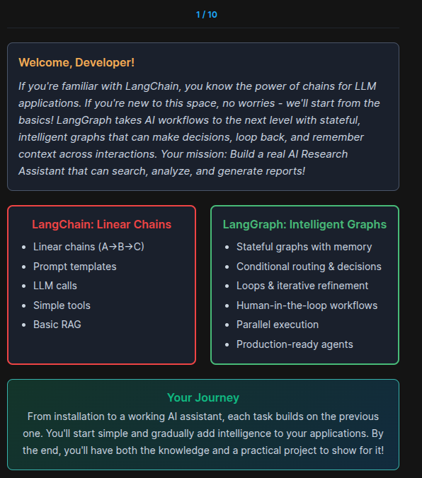
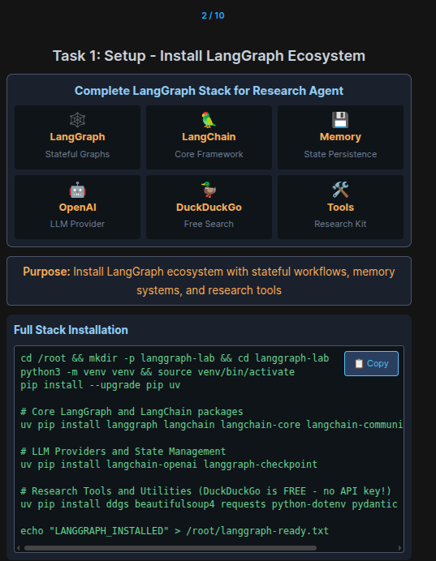

### Full Stack Installation:

```bash
cd /root && mkdir -p langgraph-lab && cd langgraph-lab
python3 -m venv venv && source venv/bin/activate
pip install --upgrade pip uv

# Core LangGraph and LangChain packages
uv pip install langgraph langchain langchain-core langchain-community

# LLM Providers and State Management
uv pip install langchain-openai langgraph-checkpoint

# Research Tools and Utilities (DuckDuckGo is FREE - no API key!)
uv pip install ddgs beautifulsoup4 requests python-dotenv pydantic typing-extensions

echo "LANGGRAPH_INSTALLED" > /root/langgraph-ready.txt
```
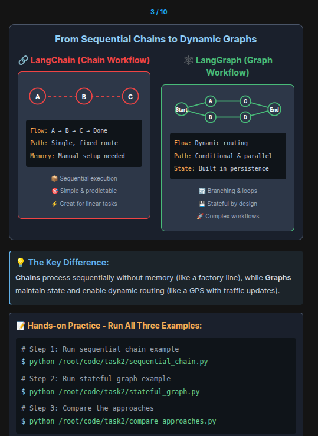

```bash
# Step 1: Run sequential chain example
$ python /root/code/task2/sequential_chain.py
# Step 2: Run stateful graph example
$ python /root/code/task2/stateful_graph.py
# Step 3: Compare the approaches
$ python /root/code/task2/compare_approaches.py
```

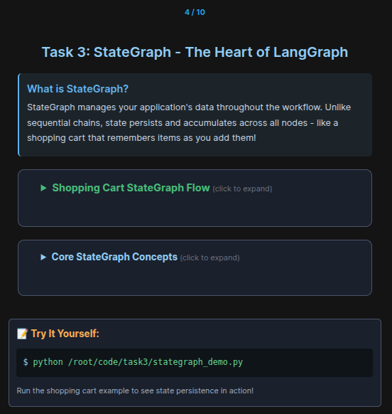

```bash
python /root/code/task3/stategraph_demo.py
```

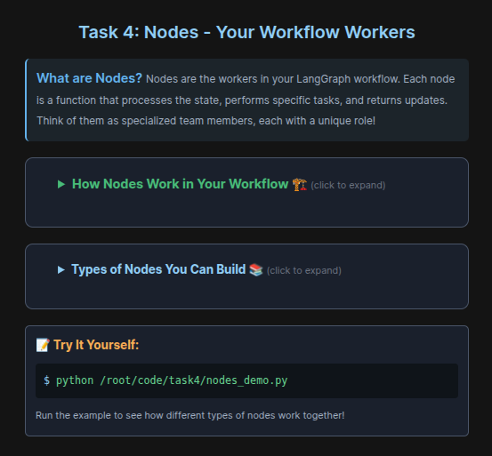
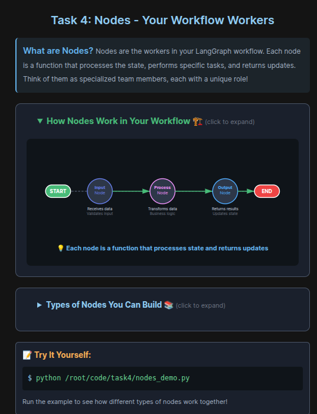
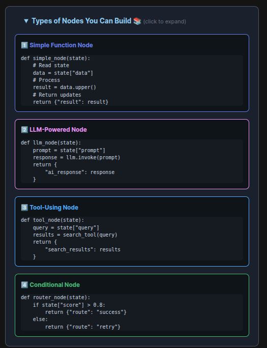

```bash
python /root/code/task4/nodes_demo.py
```

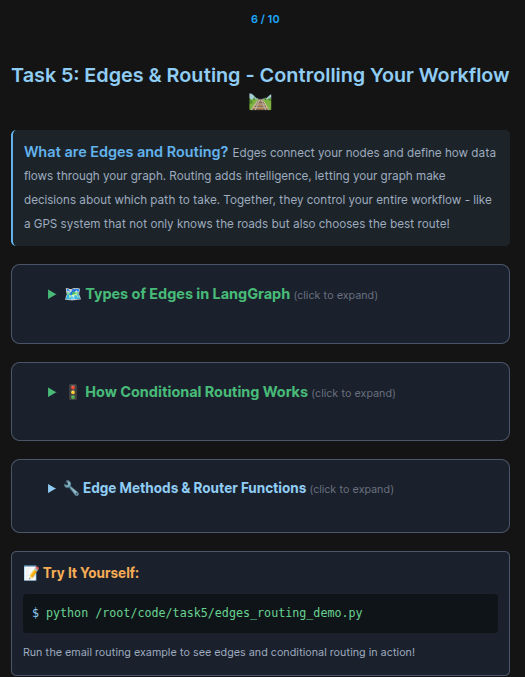
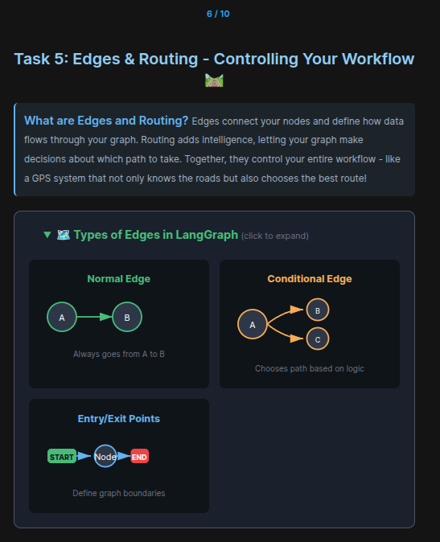
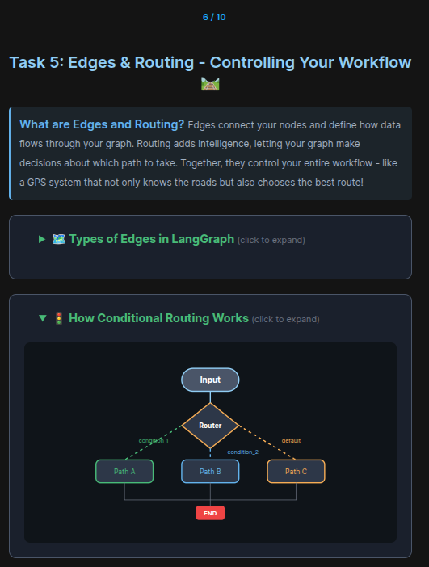
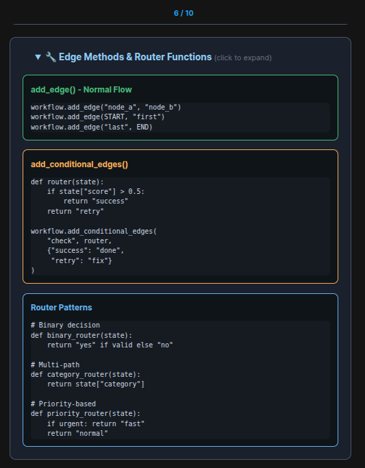

```bash
python edges_routing_demo.py
```

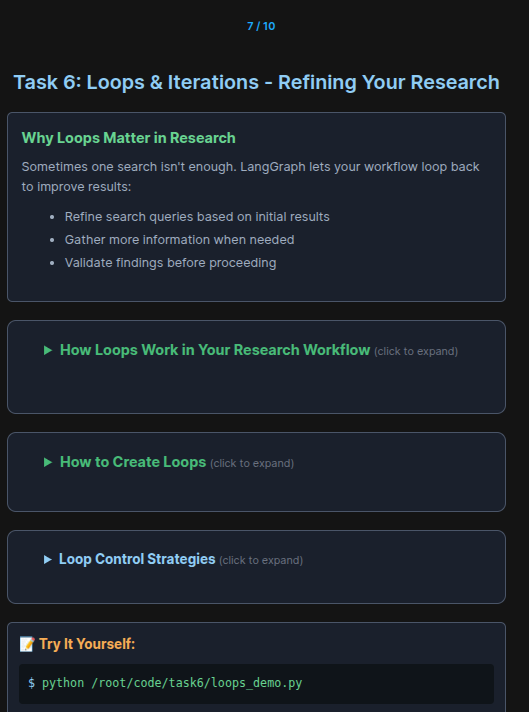
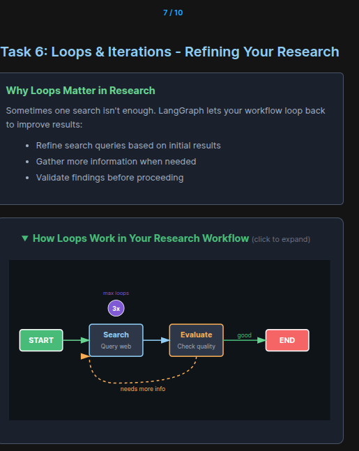
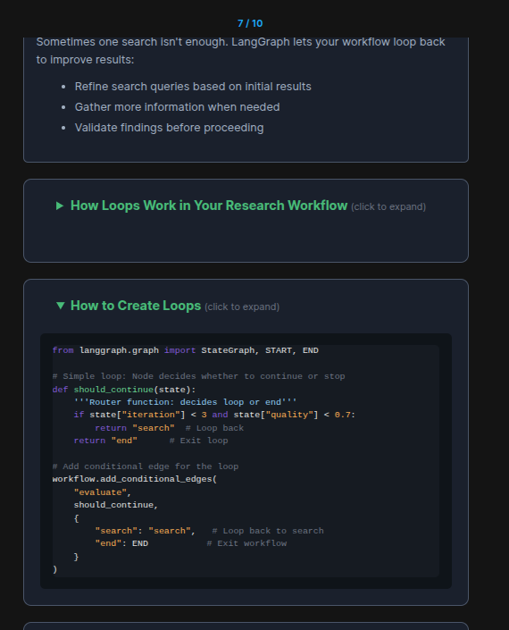
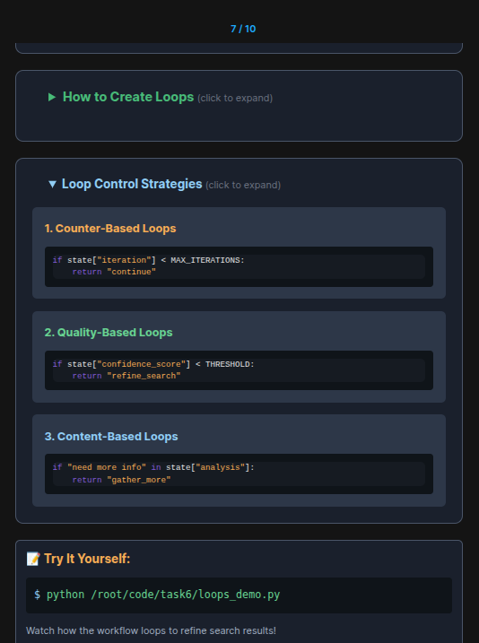

```bash
python /root/code/task6/loops_demo.py
```

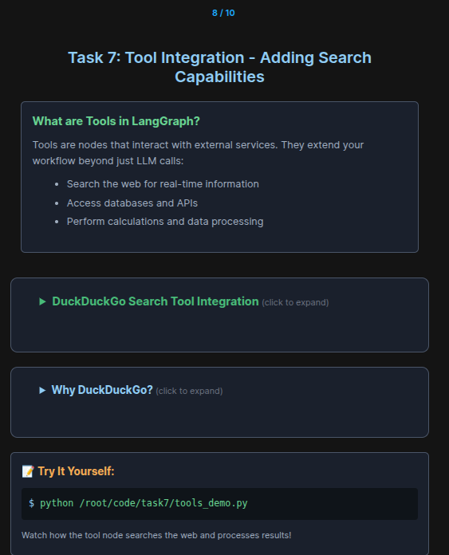
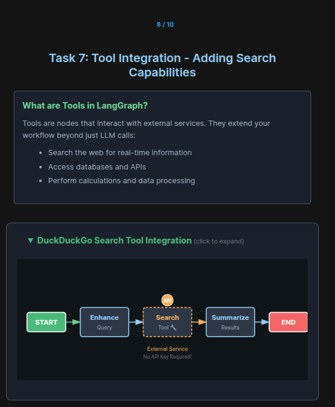
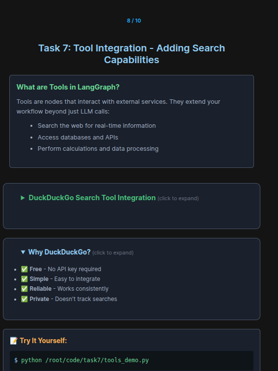


```bash
python /root/code/task6/tools_demo.py
```
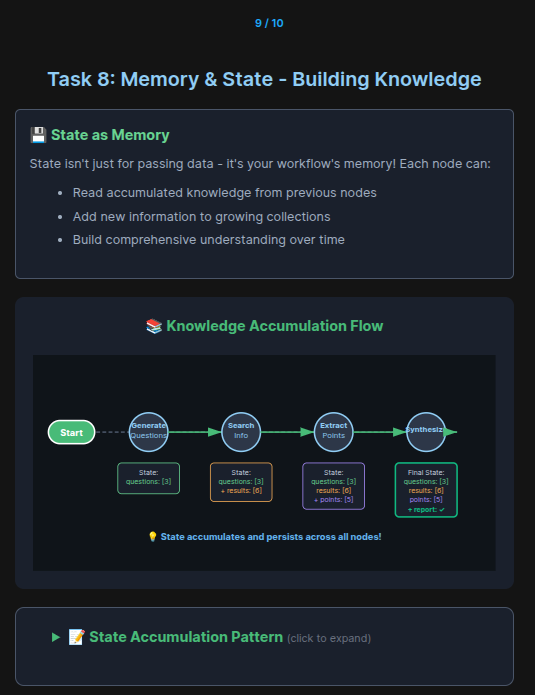
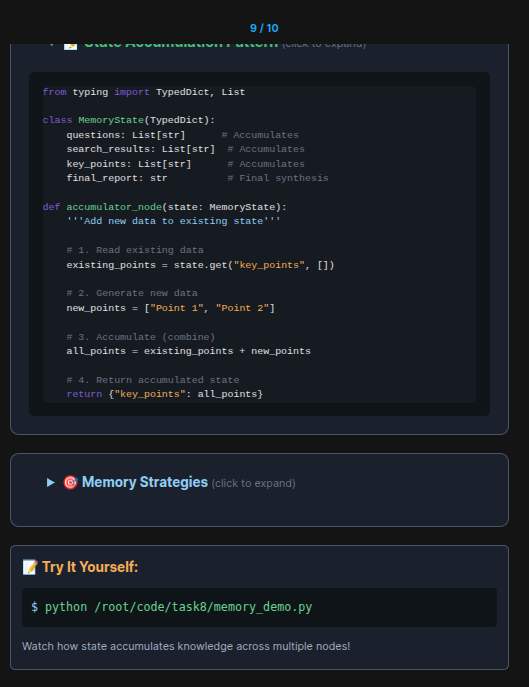
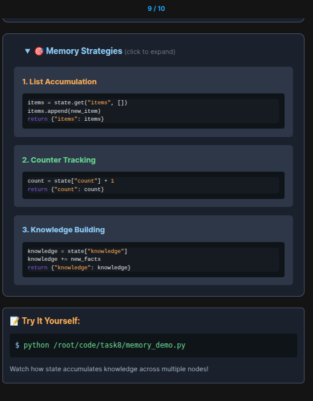

```bash
python /root/code/task8/memory_demo.py
```

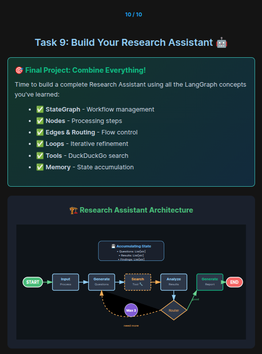
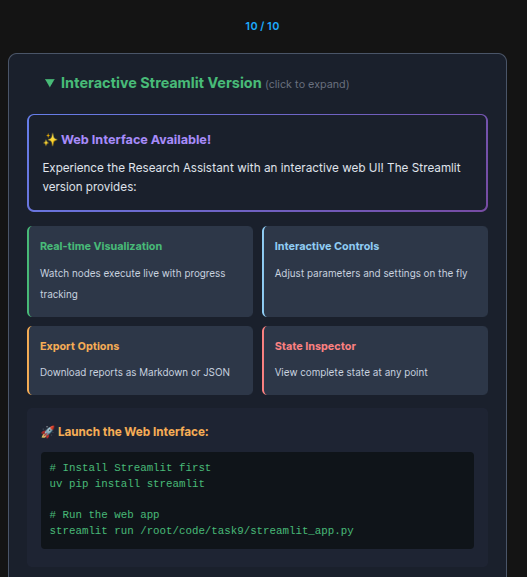
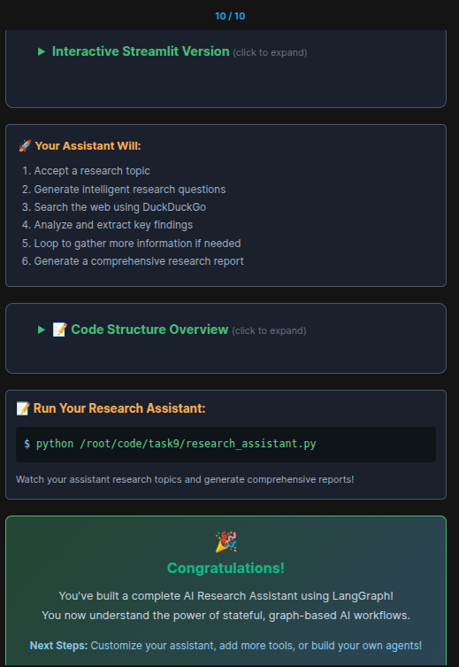

```bash
# Install Streamlit first
uv pip install streamlit

# Run the web app
streamlit run /root/code/task9/streamlit_app.py
```


```bash
python /root/code/task9/research_assistant.py
```