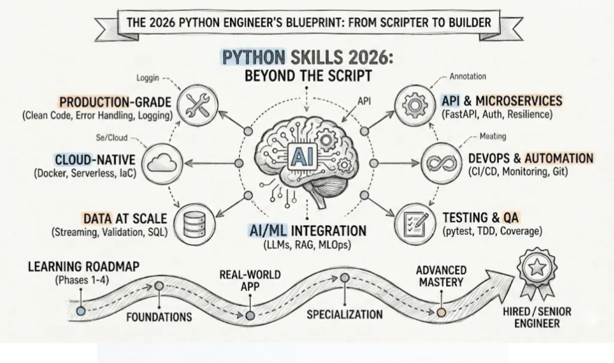

# 🚀 Python Engineer 2026 Blueprint  
## From Scripter to Systems Builder

Modern Python engineering goes beyond writing scripts.  
The 2026 Python engineer builds **scalable, production-grade, AI-integrated systems**.

---

# 🧠 Core Pillars

## 🤖 AI / ML Integration
- LLMs (Large Language Models)
- RAG (Retrieval-Augmented Generation)
- MLOps
- Model deployment
- Embeddings & vector databases

Modern systems integrate AI as a core component — not an afterthought.

---

## 🔌 API & Microservices
- FastAPI
- RESTful services
- Authentication & Authorization
- Resilience patterns
- Service communication

Every serious system exposes functionality through APIs.

---

## 🏗 Production-Grade Engineering
- Clean Code
- Error Handling
- Structured Logging
- Observability
- Environment management
- Configuration handling

Scripts solve problems.  
Production systems survive scale.

---

## ☁️ Cloud-Native Development
- Docker
- Serverless architectures
- Infrastructure as Code (IaC)
- Cloud deployment patterns

If it’s not containerized, it’s not modern.

---

## 📊 Data at Scale
- SQL
- Streaming systems
- Data validation
- ETL pipelines
- Data warehouses

Python engineers must understand data systems deeply.

---

## 🔁 DevOps & Automation
- Git workflows
- CI/CD pipelines
- Monitoring
- Automated testing
- Deployment automation

Manual deployment is not scalable.

---

## 🧪 Testing & QA
- pytest
- TDD (Test-Driven Development)
- Code coverage
- Integration testing

Testing separates hobby projects from real engineering.

---

# 🛣 Learning Roadmap

## Phase 1 — Foundations
- Python fundamentals
- OOP
- SQL
- Git
- Basic algorithms

## Phase 2 — Real-World Application
- Build and deploy an API
- Add a database
- Dockerize the app
- Implement logging and testing

## Phase 3 — Specialization
Choose one or combine:
- AI Engineering
- Data Engineering
- Backend Systems
- Cloud & DevOps

## Phase 4 — Advanced Mastery
- System design
- Scalability patterns
- Distributed systems
- Observability & monitoring
- Architecture decisions

---

# 🎯 The 2026 Engineer

The modern Python engineer can:

Design → Build → Deploy → Monitor → Scale

Not just write code — but build systems.

---

# 🔥 Example Modern Stack

```bash
Python
FastAPI
PostgreSQL
Docker
GitHub Actions
Cloud Provider (AWS/GCP/Azure)
LLMs + Vector Database
pytest
